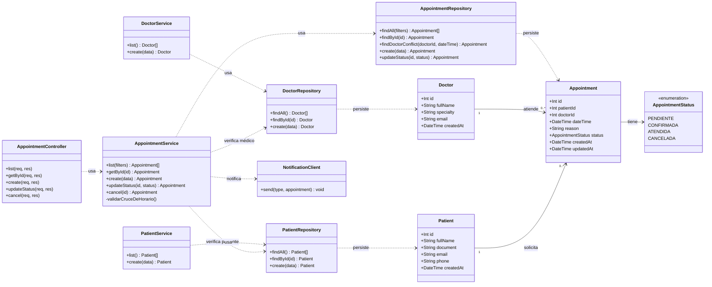
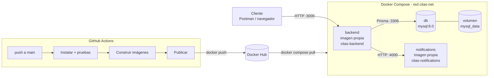

# Diagramas UML — Sistema de Citas Médicas

## 1. Diagrama de clases

```mermaid
classDiagram
    direction LR

    class Patient {
        +Int id
        +String fullName
        +String document
        +String email
        +String phone
        +DateTime createdAt
    }

    class Doctor {
        +Int id
        +String fullName
        +String specialty
        +String email
        +DateTime createdAt
    }

    class Appointment {
        +Int id
        +Int patientId
        +Int doctorId
        +DateTime dateTime
        +String reason
        +AppointmentStatus status
        +DateTime createdAt
        +DateTime updatedAt
    }

    class AppointmentStatus {
        <<enumeration>>
        PENDIENTE
        CONFIRMADA
        ATENDIDA
        CANCELADA
    }

    class AppointmentController {
        +list(req, res)
        +getById(req, res)
        +create(req, res)
        +updateStatus(req, res)
        +cancel(req, res)
    }

    class AppointmentService {
        +list(filters) Appointment[]
        +getById(id) Appointment
        +create(data) Appointment
        +updateStatus(id, status) Appointment
        +cancel(id) Appointment
        -validarCruceDeHorario()
    }

    class AppointmentRepository {
        +findAll(filters) Appointment[]
        +findById(id) Appointment
        +findDoctorConflict(doctorId, dateTime) Appointment
        +create(data) Appointment
        +updateStatus(id, status) Appointment
    }

    class PatientService {
        +list() Patient[]
        +create(data) Patient
    }

    class DoctorService {
        +list() Doctor[]
        +create(data) Doctor
    }

    class PatientRepository {
        +findAll() Patient[]
        +findById(id) Patient
        +create(data) Patient
    }

    class DoctorRepository {
        +findAll() Doctor[]
        +findById(id) Doctor
        +create(data) Doctor
    }

    class NotificationClient {
        +send(type, appointment) void
    }

    Patient "1" --> "0..*" Appointment : solicita
    Doctor "1" --> "0..*" Appointment : atiende
    Appointment --> AppointmentStatus : tiene

    AppointmentController ..> AppointmentService : usa
    AppointmentService ..> AppointmentRepository : usa
    AppointmentService ..> PatientRepository : verifica paciente
    AppointmentService ..> DoctorRepository : verifica médico
    AppointmentService ..> NotificationClient : notifica
    PatientService ..> PatientRepository : usa
    DoctorService ..> DoctorRepository : usa
    AppointmentRepository ..> Appointment : persiste
    PatientRepository ..> Patient : persiste
    DoctorRepository ..> Doctor : persiste
```

## 2. Diagrama de arquitectura y despliegue

```mermaid
flowchart LR
    C[Cliente<br/>Postman / navegador] -->|HTTP :3000| B

    subgraph DC[Docker Compose - red citas-net]
        B[backend<br/>imagen propia<br/>citas-backend] -->|Prisma :3306| DB[(db<br/>mysql:8.0)]
        B -->|HTTP :4000| N[notifications<br/>imagen propia<br/>citas-notifications]
        DB --- V[(volumen<br/>mysql_data)]
    end

    subgraph CI[GitHub Actions]
        G[push a main] --> T[Instalar + pruebas] --> BU[Construir imágenes] --> P[Publicar]
    end

    P -->|docker push| H[(Docker Hub)]
    H -->|docker compose pull| DC
```
